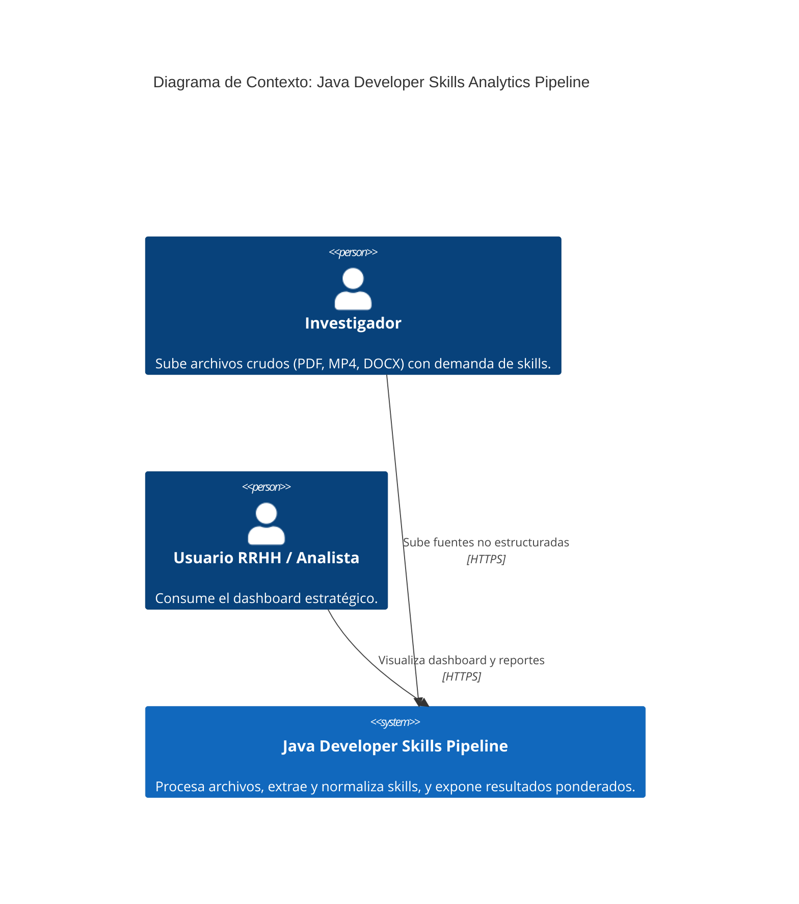
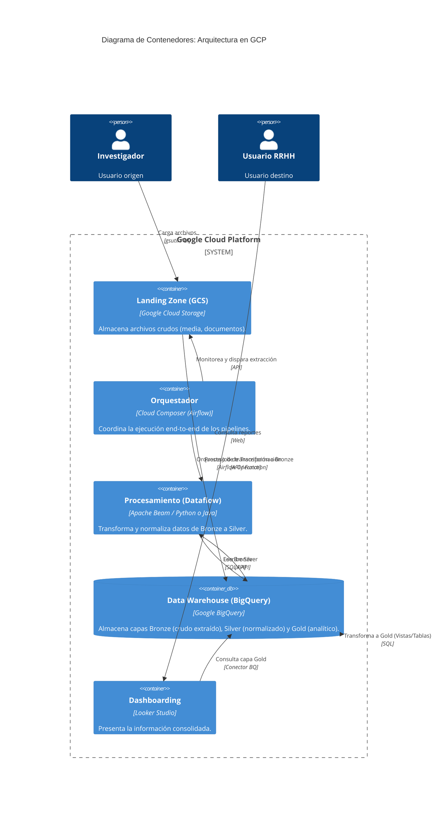
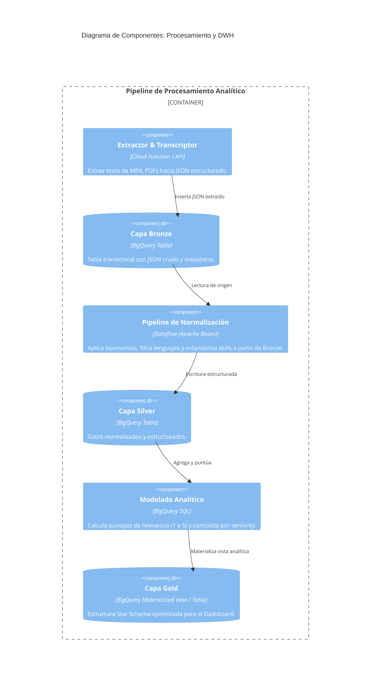

# Engineering Brief: Java Developer Skills Analytics Pipeline

## 1. Introducción
Este documento define la arquitectura técnica y los lineamientos de ingeniería para el proyecto "Java Developer Skills Analytics Pipeline". Siguiendo el enfoque del modelo C4, detallamos los niveles de Contexto, Contenedores y Componentes, además de justificar las decisiones tecnológicas y lineamientos de calidad para el despliegue en Google Cloud Platform (GCP).

## 2. Arquitectura del Sistema (Modelo C4)

### 2.1. Diagrama de Contexto (Context)
El sistema interactúa con diversos usuarios (Investigadores, Ingenieros, RRHH) que proveen fuentes de datos y consumen los resultados analíticos.

### 2.2. Diagrama de Contenedores (Containers)
Muestra los servicios principales de GCP utilizados para la ingesta, procesamiento, almacenamiento y visualización.

### 2.3. Diagrama de Componentes (Components)
Detalle del flujo de procesamiento interno y la transformación de datos entre capas en BigQuery y Dataflow.

## 3. Definiciones Técnicas y Lineamientos

### 3.1. Estructura de Capas de Datos (Data Lakehouse)
- **Landing:** Almacenamiento en Object Storage (Cloud Storage). Particionamiento físico por fecha de carga (`gs://[BUCKET-NAME]-landing/YYYY/MM/DD/archivos`).
- **Bronze:** Datos extraídos de los archivos originales. Transformados en JSON o cadenas de texto estructuradas dentro de una tabla de BigQuery transicional.
- **Silver:** Datos tabulares estructurados y depurados.
- **Gold:** Nivel analítico / Dashboarding. Almacena las agregaciones de los requerimientos, los top skills, clasificados de 1 al 5.

### 3.2. Políticas de Particionamiento y Clustering
- **Particionamiento:** Toda tabla en las capas Silver y Gold debe implementar particionamiento automático sobre la fecha de procesamiento (`_PARTITIONTIME` o campos `TIMESTAMP` explícitos) limitando el volumen escaneado en consultas futuras.
- **Clustering:** Implementar clustering en BigQuery sobre las dimensiones de filtro primordiales, como `skill_name`, `skill_category`, y el nivel de desarrollador (`seniority_level`), agilizando su ordenamiento en consultas masivas desde el dashboard.

### 3.3. Identidades Administradas por Capa (Least Privilege)
La seguridad del DWH recae en el principio de mínimo privilegio asignando *Identidades Administradas* (Service Accounts exclusivas):
- **SA-Composer:** Posee permisos para ejecutar orquestación, consumir APIs de Google APIs, arrancar Jobs de Dataflow y realizar logs en BQ y Cloud Logging.
- **SA-Dataflow:** Worker account que manipula el cómputo masivo, leyendo transacciones Bronze y registrándolas en capa Silver (`roles/bigquery.dataEditor`, `roles/storage.objectAdmin`).
- **SA-Looker:** Cuenta de lectura dedicada para uso analítico. Permisos ajustados a las vistas y tablas finales de la capa Gold (`roles/bigquery.dataViewer`, `roles/bigquery.jobUser`). Restringida en alcance por Dataset.

### 3.4. Code Review (Evaluación de Calidad de Software)
Validaciones técnicas estrictas aplicables a Pull Requests:
- **Infraestructura (Terraform):** Se validan módulos HCL reusables. Toda infraestructura (Buckets, Datasets BQ, Cloud Composer Environment, SAs) debe levantarse vía IaC, no mediante la consola GCP.
- **DAGs (Airflow):** Deben utilizar diseño modular y **paradigmas idempotentes** para su ejecución sin duplicar datos sobre reintentos. Manejo granular de fallas y alertas (ej. retries por Operator, callbacks on failure).
- **Procesamiento de Datos Beam:** Estructuración orientada a objetos (DoFn separadas por lógica del negocio de normalización) aplicando un robusto control de excepciones (manejo de *dead letter queues* o sink error tables) ante un JSON corrupto extraído desde Bronze.

## 4. Evaluador Tecnológico: Justificaciones de Negocio y Económicas

Como filter criteria de nuestra Arquitectura Tecnológica en GCP, la selección de herramientas asegura un diseño de bajo mantenimiento y alta eficiencia:

### 4.1. Elección Económica de Dataflow
- **Agnosticismo Portátil:** Apache Beam permite desligar la lógica (programable en Python o Java SDKs) del engine subyacente de GCP.
- **Viabilidad Financiera:** Ante el bajo y pulsátil volumen esperado de los lotes de extracción, el aprovisionar clústeres full-stack (ej. Dataproc) encarece el mantenimiento. El perfil transitorio de Dataflow (**Serverless Autoscaling**) factura estrictamente por cómputo consumido durante el runtime del job de transferencia Bronze a Silver, eliminando horas ociosas de cómputo inactivo.

### 4.2. Estrategia de Acceso al Dashboard (Looker Studio + BigQuery MV)
El principal riesgo económico en un Data Warehouse son las consultas on-demand ineficientes o repetidas vinculadas a la interacción masiva con un Dashboard (Looker Studio):
- Looker Studio se conecta con el conector nativo para BigQuery y no añade costos directos sobre visualización.
- **Tablas Materializadas o Caches Computados:** En la última milla, la capa Gold ofrecerá las topologies de las habilidades ya tabuladas, o a través de BigQuery Materialized Views (o vistas precalculadas periodicamente vía Airflow). Esto evitará "recostear el query on-demand por refresco del dashboard", sirviendo un snapshot indexado al backend estadístico final para que la métrica de 1 a 5 y el orden exhaustivo respondan en latencias sub-segundo con el coste minimizado.

## 5. Stack Tecnológico (Technology Stack)
El proyecto se apoya en una pila tecnológica moderna y orientada a la nube pública de Google:
- **Lenguaje de Programación:** Python 3.11 (utilizado de forma transversal en todo el código de aplicación, scripts de extracción y DAGs).
- **Procesamiento Distribuido:** Google Cloud Dataflow (con flujos escritos utilizando **Dataflow Templates** y basados en Apache Beam).
- **Orquestación de Flujos:** Google Cloud Composer (Apache Airflow) para orquestar la ingesta, movimiento y procesamiento de datos.
- **Data Warehouse Analítico:** Google BigQuery (capas Bronze, Silver, y Gold materializadas).
- **Data Lake (Almacenamiento Crudo):** Google Cloud Storage para Landing Zone y almacenamiento de archivos sin estructura.
- **Visualización y Reporte:** Looker Studio integrado directamente con BigQuery.
- **Infraestructura como Código (IaC):** Terraform (archivos `.tf` y `.tfvars` escritos en HCL) para un despliegue modular e inmutable.
- **Modelado de Arquitectura:** Integridad documental mediante Markdown y diagramas generados en código (Mermaid y el modelo estándar C4).
