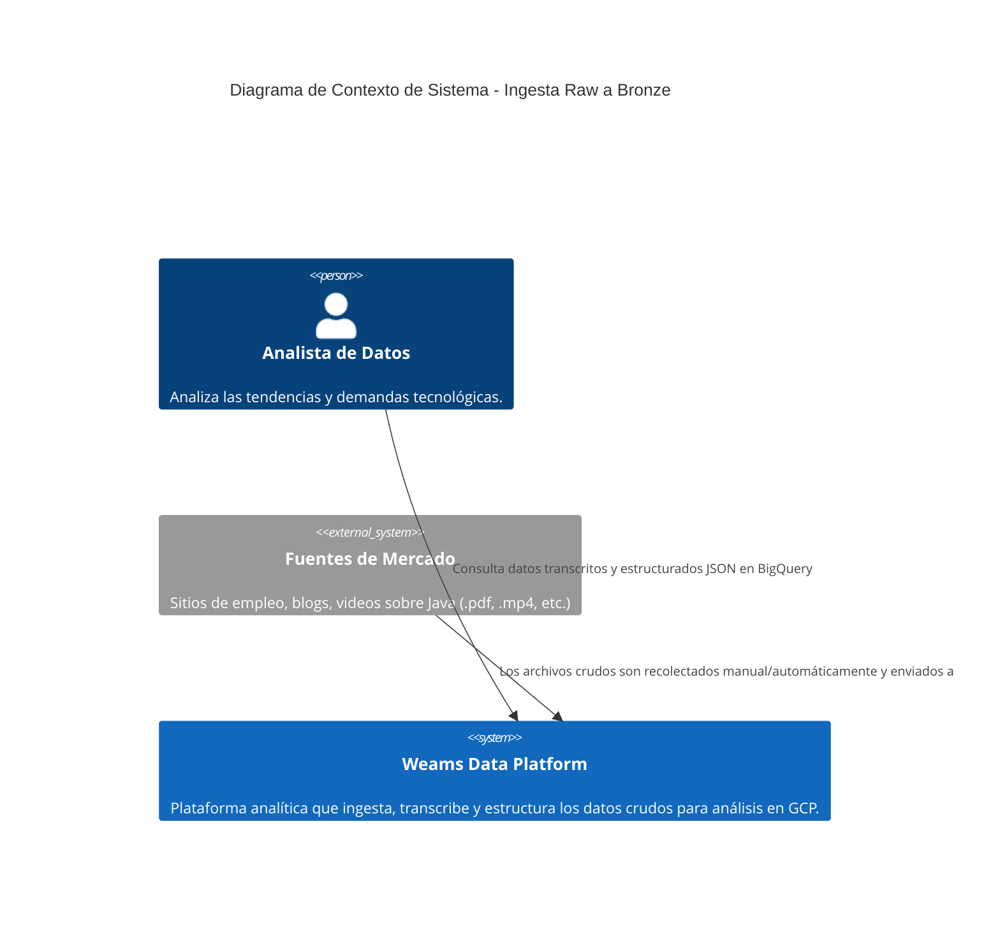
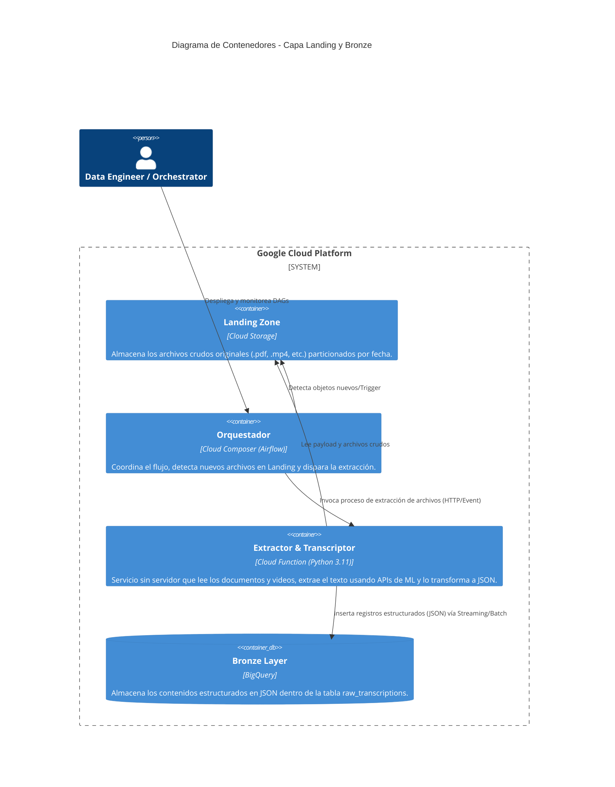
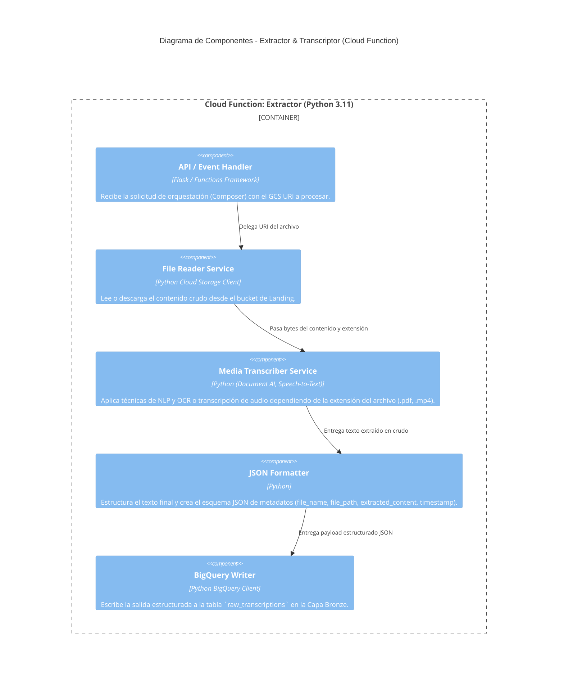

# Arquitectura del Extractor y Transcriptor (Capa Bronze)

Este documento describe la arquitectura C4 (Context, Container, Component) para el sistema de extracción y transcripción de datos crudos (Landing Zone en GCS) hacia datos semi-estructurados (JSON en BigQuery Capa Bronze), según los requerimientos de la Épica 1.

## Nivel 1: Diagrama de Contexto de Sistema (System Context)

## Nivel 2: Diagrama de Contenedores (Containers)

## Nivel 3: Diagrama de Componentes (Components)

## Decisiones Técnicas Evaluadas
- **Despliegue Serverless**: El Extractor utiliza Cloud Functions asegurando costos bajo demanda y soporte nativo Python 3.11, en lugar de un cluster dedicado.
- **Identidades Administradas**: Se usan de forma específica `sa-bronze-extractor` para la función, aislando permisos (Storage Object Admin y BQ Data Editor únicamente).
- **Tipado BigQuery**: El esquema en Bronze usa el tipo de dato `JSON` para `extracted_content`, permitiendo flexibilidad sin rediseños del esquema relacional en Bronze.
- **Idempotencia**: El orquestador o la función debe verificar si el `file_path` ya está registrado en `raw_transcriptions` antes de la inserción, de cara a re-procesamientos.
